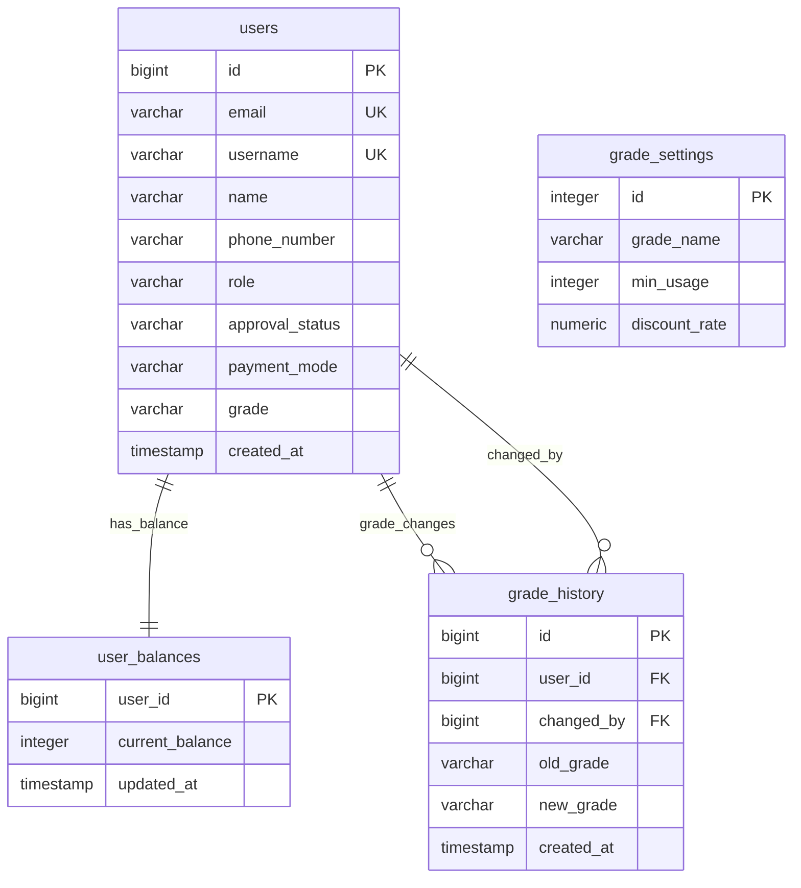
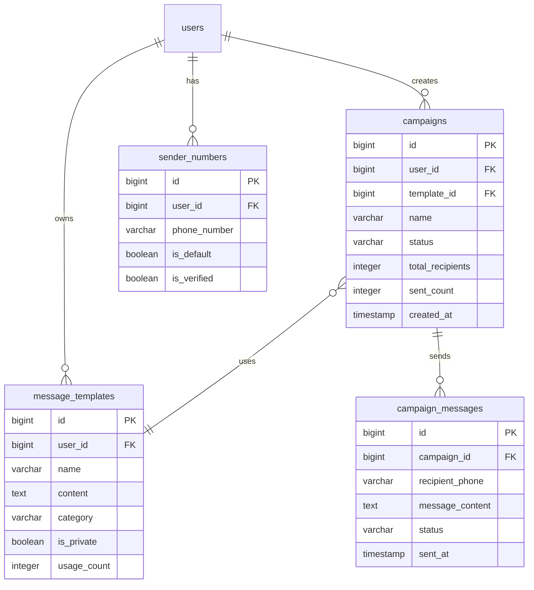
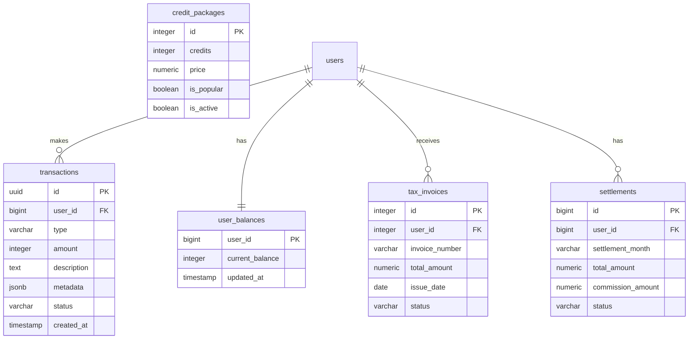
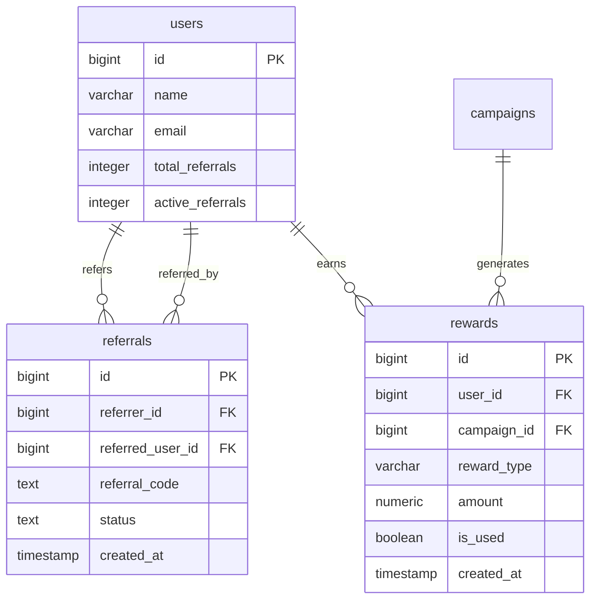
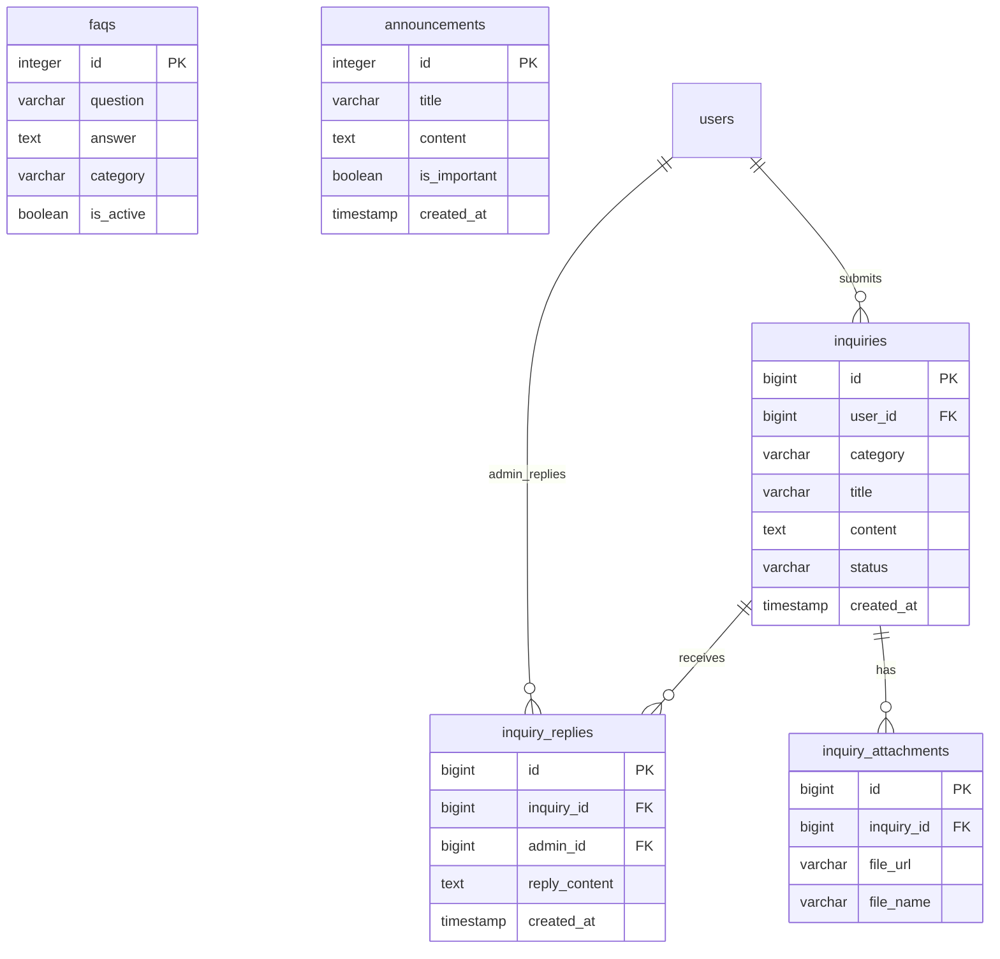
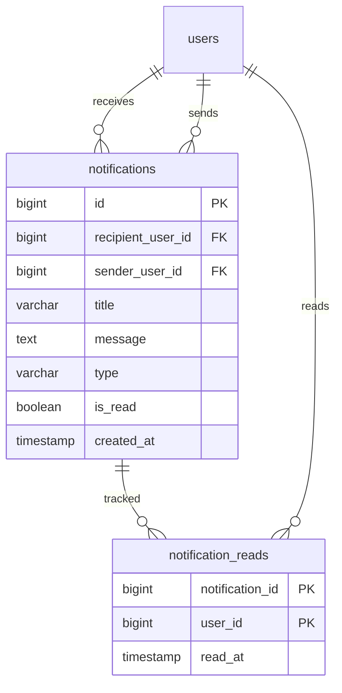

# MTS Message 데이터베이스 ERD - Mermaid 다이어그램

## 전체 ERD (Mermaid)

```mermaid
erDiagram
    %% 사용자 관리
    users {
        bigint id PK
        varchar email UK
        varchar username UK
        varchar password
        varchar name
        varchar phone_number
        varchar role
        varchar approval_status
        jsonb company_info
        jsonb tax_invoice_info
        jsonb documents
        varchar payment_mode
        varchar grade
        boolean is_active
        timestamp created_at
        timestamp updated_at
    }
    
    user_balances {
        bigint user_id PK
        integer current_balance
        timestamp updated_at
    }
    
    companies {
        bigint id PK
        varchar name
        varchar business_number
        jsonb company_info
        timestamp created_at
    }
    
    company_documents {
        bigint id PK
        bigint company_id FK
        varchar document_type
        varchar file_url
        timestamp created_at
    }
    
    %% 캠페인 시스템
    campaigns {
        bigint id PK
        bigint user_id FK
        bigint template_id FK
        varchar name
        text description
        varchar status
        integer total_recipients
        integer sent_count
        integer success_count
        integer failed_count
        numeric budget
        jsonb target_criteria
        text message_template
        timestamp created_at
    }
    
    campaign_messages {
        bigint id PK
        bigint campaign_id FK
        varchar recipient_phone
        text message_content
        varchar status
        timestamp sent_at
    }
    
    campaign_targets {
        bigint id PK
        bigint campaign_id FK
        varchar target_phone
        jsonb target_data
        timestamp created_at
    }
    
    campaign_rejections {
        bigint id PK
        bigint campaign_id FK
        bigint admin_user_id FK
        text rejection_reason
        timestamp created_at
    }
    
    %% 메시지 템플릿
    message_templates {
        bigint id PK
        bigint user_id FK
        varchar name
        text content
        text image_url
        varchar category
        jsonb variables
        jsonb buttons
        boolean is_private
        boolean is_active
        integer usage_count
        timestamp created_at
    }
    
    message_logs {
        bigint id PK
        bigint campaign_message_id FK
        varchar status
        text error_message
        timestamp created_at
    }
    
    %% 발신번호
    sender_numbers {
        bigint id PK
        bigint user_id FK
        varchar phone_number
        varchar display_name
        boolean is_default
        boolean is_verified
        boolean is_user_phone
        timestamp created_at
    }
    
    %% 거래 시스템
    transactions {
        uuid id PK
        bigint user_id FK
        varchar type
        integer amount
        text description
        varchar reference_id
        jsonb metadata
        varchar status
        timestamp created_at
    }
    
    payments {
        bigint id PK
        bigint campaign_id FK
        numeric amount
        varchar payment_method
        varchar status
        timestamp created_at
    }
    
    payment_methods {
        bigint id PK
        bigint user_id FK
        varchar method_type
        jsonb method_details
        boolean is_default
        timestamp created_at
    }
    
    credit_packages {
        integer id PK
        integer credits
        integer bonus_credits
        numeric price
        boolean is_popular
        boolean is_active
        integer display_order
    }
    
    %% 추천 시스템
    referrals {
        bigint id PK
        bigint referrer_id FK
        bigint referred_user_id FK
        text referral_code
        text status
        timestamp created_at
    }
    
    rewards {
        bigint id PK
        bigint user_id FK
        bigint campaign_id FK
        varchar reward_type
        numeric amount
        text description
        boolean is_used
        timestamp created_at
    }
    
    %% 정산
    settlements {
        bigint id PK
        bigint user_id FK
        varchar settlement_month
        integer total_campaigns
        integer total_messages
        numeric total_amount
        numeric commission_amount
        varchar status
        timestamp created_at
    }
    
    tax_invoices {
        integer id PK
        integer user_id FK
        varchar invoice_number
        date issue_date
        varchar business_number
        varchar company_name
        numeric total_amount
        varchar status
        timestamp created_at
    }
    
    %% 후불제
    postpaid_subscriptions {
        bigint id PK
        bigint user_id FK
        varchar plan_type
        numeric monthly_limit
        varchar status
        timestamp created_at
    }
    
    postpaid_usage {
        bigint id PK
        bigint subscription_id FK
        integer usage_count
        numeric usage_amount
        date usage_date
        timestamp created_at
    }
    
    %% 문의 시스템
    inquiries {
        bigint id PK
        bigint user_id FK
        varchar category
        varchar title
        text content
        varchar contact_phone
        varchar status
        timestamp created_at
    }
    
    inquiry_replies {
        bigint id PK
        bigint inquiry_id FK
        bigint admin_id FK
        text reply_content
        timestamp created_at
    }
    
    inquiry_attachments {
        bigint id PK
        bigint inquiry_id FK
        varchar file_url
        varchar file_name
        timestamp created_at
    }
    
    %% 알림 시스템
    notifications {
        bigint id PK
        bigint recipient_user_id FK
        bigint sender_user_id FK
        varchar title
        text message
        varchar type
        boolean is_read
        timestamp created_at
    }
    
    notification_reads {
        bigint notification_id PK
        bigint user_id PK
        timestamp read_at
    }
    
    %% 고객 지원
    faqs {
        integer id PK
        varchar question
        text answer
        varchar category
        integer display_order
        boolean is_active
    }
    
    announcements {
        integer id PK
        varchar title
        text content
        boolean is_important
        uuid created_by
        timestamp created_at
    }
    
    %% 시스템 설정
    system_settings {
        integer id PK
        jsonb menu_settings
        jsonb site_settings
        numeric first_level_commission_rate
        integer nth_level_denominator
        timestamp updated_at
    }
    
    grade_settings {
        integer id PK
        varchar grade_name
        integer min_usage
        integer max_usage
        numeric discount_rate
        timestamp created_at
    }
    
    grade_history {
        bigint id PK
        bigint user_id FK
        bigint changed_by FK
        varchar old_grade
        varchar new_grade
        text change_reason
        timestamp created_at
    }
    
    %% 관계 정의
    users ||--o{ campaigns : "creates"
    users ||--o{ message_templates : "owns"
    users ||--o{ sender_numbers : "has"
    users ||--o{ transactions : "makes"
    users ||--o{ referrals : "referrer"
    users ||--o{ referrals : "referred"
    users ||--o{ inquiries : "submits"
    users ||--o{ notifications : "receives"
    users ||--o{ notifications : "sends"
    users ||--o{ tax_invoices : "has"
    users ||--o{ settlements : "has"
    users ||--|| user_balances : "has"
    
    campaigns ||--o{ campaign_messages : "contains"
    campaigns ||--o{ campaign_targets : "targets"
    campaigns ||--o{ campaign_rejections : "rejected"
    campaigns ||--o{ payments : "paid_by"
    campaigns }o--|| message_templates : "uses"
    
    campaign_messages ||--o{ message_logs : "logs"
    
    inquiries ||--o{ inquiry_replies : "has"
    inquiries ||--o{ inquiry_attachments : "has"
    
    notifications ||--o{ notification_reads : "read_by"
    
    companies ||--o{ company_documents : "has"
    
    postpaid_subscriptions ||--o{ postpaid_usage : "tracks"
    
    grade_history }o--|| users : "changed_by"
    grade_history }o--|| users : "for_user"
    
    rewards }o--|| campaigns : "from"
    
    notification_reads }o--|| users : "by_user"
    notification_reads }o--|| notifications : "for_notification"
    
    inquiry_replies }o--|| users : "by_admin"
    
    campaign_rejections }o--|| users : "by_admin"
```

## 핵심 도메인별 ERD

### 1. 사용자 및 인증 시스템

### 2. 캠페인 및 메시징 시스템

### 3. 결제 및 크레딧 시스템

### 4. 추천 시스템

### 5. 고객 지원 시스템

### 6. 알림 시스템

## 사용 방법

1. **GitHub에서 보기**: GitHub은 Mermaid 다이어그램을 자동으로 렌더링합니다.

2. **VS Code에서 보기**: Mermaid 확장 프로그램 설치 후 미리보기 가능

3. **온라인 에디터**: 
   - [Mermaid Live Editor](https://mermaid.live/)
   - 코드 복사 후 붙여넣기

4. **Markdown 미리보기**: 대부분의 Markdown 뷰어에서 자동 렌더링

## 주요 관계 설명

- `||--o{` : 일대다 관계 (One to Many)
- `||--||` : 일대일 관계 (One to One)
- `}o--||` : 다대일 관계 (Many to One)
- `PK` : Primary Key
- `FK` : Foreign Key
- `UK` : Unique Key

---

*이 Mermaid ERD는 실제 Supabase 데이터베이스 구조를 기반으로 작성되었습니다.*